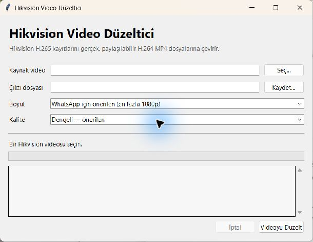

# Hikvision Video Düzeltici

**Türkçe** | [English](README.md)

Hikvision kameraların `.mp4` uzantısıyla dışa aktardığı, ancak standart olmayan
MPEG kapsayıcı ve H.265/HEVC video kullanan kayıtları WhatsApp, telefonlar ve web
tarayıcılarıyla uyumlu MP4 dosyalarına dönüştüren Windows aracıdır.

Kaynak kayıt değiştirilmez veya silinmez. Yeni video aynı klasörde
`_WhatsApp.mp4` ekiyle oluşturulur.

## Hangi sorunu çözer?

Bu araç **Hikvision MP4 açılmıyor**, telefon kaydı oynatmıyor veya **WhatsApp
videonun bozuk olduğunu söylüyor** gibi durumlar içindir. Bazı Hikvision
dışa aktarımları `.mp4` uzantısına rağmen MPEG program akışı içinde H.265/HEVC
video kullanır. Araç kaydı, çok daha fazla oynatıcı ve mesajlaşma uygulamasının
kabul ettiği standart H.264 MP4 biçiminde yeniden oluşturur.

## Özellikler

- Standart dışı Hikvision dışa aktarımlarını otomatik algılar.
- Bozuk paketleri atlar ve eksik zaman damgalarını yeniden oluşturur.
- Videoyu MP4 içinde H.264 High Profile ve `yuv420p` biçimine dönüştürür.
- Varsa sesi AAC stereo biçimine çevirir.
- MP4 `faststart` düzeni sayesinde videonun indirme sürerken başlamasını sağlar.
- Önerilen 1080p, küçük dosya için 720p ve özgün çözünürlük seçenekleri sunar.
- Dönüştürme sonunda codec, kapsayıcı ve renk biçimini doğrular.
- Türkçe Windows kurulumlarında otomatik Türkçe, diğer bütün Windows görüntüleme
  dillerinde İngilizce açılır.
- İlerleme göstergesi ve iptal desteği içeren grafik arayüz sunar.

## Ekran görüntüsü



## Gereksinimler

- Windows 10 veya 11
- Python 3.10 veya üzeri
- `libx264` destekli [FFmpeg](https://ffmpeg.org/)

Araç önce sistem `PATH` değişkeninde FFmpeg'i arar. Alternatif olarak
`ffmpeg.exe` ve `ffprobe.exe` dosyaları uygulamanın yanına, `bin` klasörüne veya
`ffmpeg\bin` klasörüne konabilir.

## Kullanım

1. `Hikvision Video Duzeltici.bat` dosyasına çift tıklayın.
2. **Seç…** düğmesiyle kamera videosunu seçin.
3. İhtiyaç halinde boyut ve kalite ayarlarını değiştirin.
4. **Videoyu Düzelt** düğmesine basın.
5. Oluşturulan `_WhatsApp.mp4` dosyasını paylaşın.

Bir video dosyasını doğrudan `.bat` dosyasının üzerine sürükleyip bırakarak da
arayüzde açabilirsiniz.

## Dil

Uygulama Windows görüntüleme dilini otomatik izler. Windows arayüz dili Türkçeyse
Türkçe, diğer tüm dillerde İngilizce açılır. Elle dil seçmek gerekmez.

## İndirme

En güncel paketi [GitHub Releases](https://github.com/umeyir061/hikvision-video-converter/releases/latest)
sayfasından indirin, ZIP dosyasını açın ve `Hikvision Video Duzeltici.bat`
dosyasına çift tıklayın. Yukarıda belirtilen Python ve FFmpeg gereksinimleri
geçerlidir.

## Komut satırı

```powershell
python .\hikvision_video_duzeltici.py "kamera.mp4" --cli
```

Örnek seçenekler:

```powershell
# Daha küçük 720p çıktı
python .\hikvision_video_duzeltici.py "kamera.mp4" --cli --size 720p

# Belirli bir çıktı yolu ve yüksek kalite
python .\hikvision_video_duzeltici.py "kamera.mp4" --cli --crf 20 -o "duzeltilmis.mp4"

# Var olan çıktının üzerine yaz
python .\hikvision_video_duzeltici.py "kamera.mp4" --cli --overwrite
```

Tüm seçenekler için:

```powershell
python .\hikvision_video_duzeltici.py --help
```

## Gizlilik

Video dosyaları `.gitignore` tarafından dışlanır. Kamera kayıtları ve oluşturulan
çıktılar repoya eklenmez.

## Lisans

Bu proje [MIT Lisansı](LICENSE) ile sunulur. Kişisel veya ticari amaçla
kullanabilir, değiştirebilir ve yeniden dağıtabilirsiniz; telif ve lisans
bildiriminin kopyalarda korunması gerekir.
